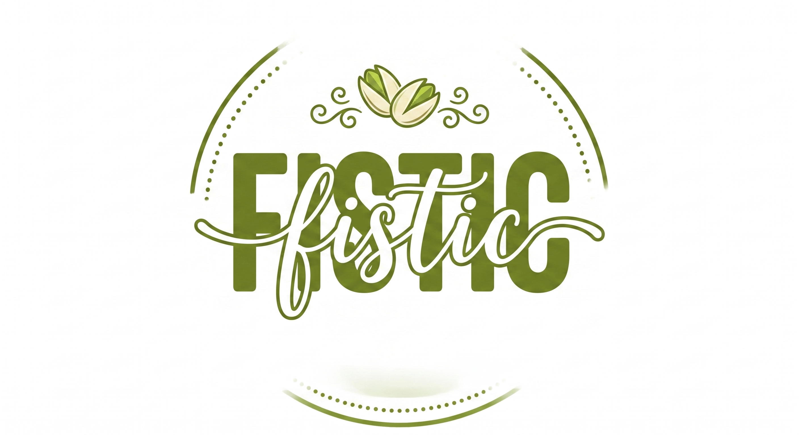

# FISTIC

<p align="center">
  
</p>

<p align="center">
  
  
  
  
  
  
</p>

<p align="center">
  Presentation website for <strong>FISTIC</strong>, built as a portfolio-ready frontend project with <strong>Next.js</strong>, <strong>Bun</strong>, and custom animated UI components.
</p>

## Preview

<p align="center">
  
  
  
</p>

Note: the project also includes code-generated Open Graph and Twitter images through `next/og`.  
If the website is deployed publicly, the generated social image can be used as the main preview image as well.

## Project Goal

This project was built with a clear technical purpose:

- to experiment with `Bun` in a real frontend workflow
- to build a polished landing page using `Next.js` App Router
- to test deployment through `Vercel`
- to integrate animated UI patterns inspired by `React Bits`
- to produce a clean website suitable for a portfolio

## Why This Stack

- `Next.js 16`
  for App Router, metadata routes, legal pages, and social image generation
- `Bun`
  for a fast modern dev/build workflow and hands-on experimentation outside the usual npm setup
- `Vercel`
  because it is the most direct hosting target for a Next.js project
- custom `React Bits`-style components
  to explore interactive, reusable UI blocks instead of static marketing layout patterns

## What’s Inside

- single-page landing page in `app/page.tsx`
- animated hero with a carousel inside a `TiltedCard`
- visual product gallery using `Masonry`
- service, location, and contact sections
- legal pages for Terms, Privacy Policy, and ANPC
- code-generated `Open Graph` and `Twitter` images
- reusable animated UI components in `components/`

## Build Process

The implementation followed a straightforward frontend product workflow:

1. Define the visual structure, color direction, and copy based on the project docs.
2. Build the landing page as a focused one-page experience.
3. Adapt the component set for `Next.js` App Router compatibility.
4. Refine layout, motion, typography, and image presentation.
5. Add legal pages and metadata routes.
6. Generate share images from code using `next/og`.

## Tech Stack

- Next.js
- React
- TypeScript
- Bun
- Tailwind CSS
- GSAP
- Motion
- Custom UI components

## Project Structure

- `app/`
  routes, pages, metadata handlers, Open Graph image routes
- `components/`
  UI components and animations
- `assets/`
  product images and branding assets
- `docs/`
  project structure, palette, and content references
- `lib/`
  helpers such as social image generation

## Running Locally

```bash
bun install
bun dev
```

Production build:

```bash
bun run build
```

## Deployment

This project is intended to be deployed on `Vercel`.

## Portfolio Context

- end-to-end frontend implementation
- practical use of Next.js App Router
- metadata and Open Graph generation
- reusable animated component integration
- a clean, presentable codebase for portfolio use
